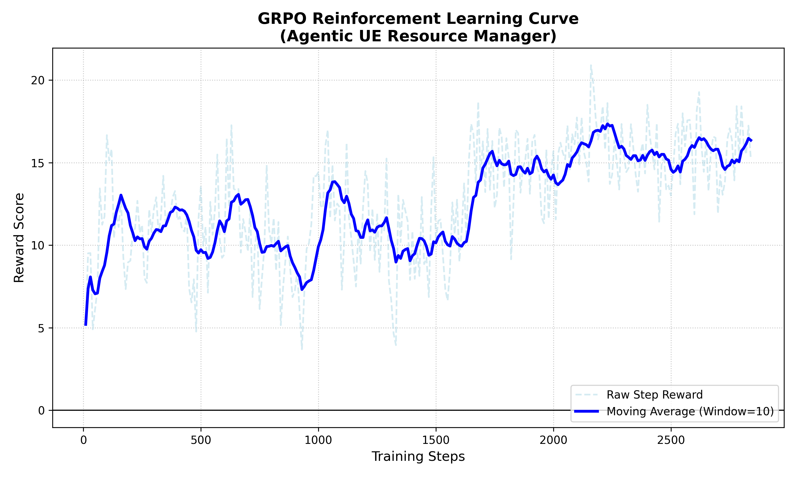

# Agentic UE Resource Manager

> **Copyright (c) 2026 [Sayantini Majumdar/https://github.com/tini-creator/agentic-ue-grpo.git]**
> **All rights reserved. No part of this repository may be used, redistributed, or modified in any form or by any means without the prior written permission of the author.**

A reinforcement learning pipeline that fine-tunes a small language model to act as an autonomous **User Equipment (UE) resource manager** for 6G applications. Given a natural-language description of device state (battery level, running application, network condition) for an ongoing application at the UE, the model outputs a structured device configuration in JSON — selecting power mode, DRX cycle, compute offload flag, and maximum bandwidth. This work is based on the paradigm Reinforcement Learning for Verifiable Rewards (RLVR).

The pipeline runs entirely on **CPU** and is built on [SmolLM2-135M](https://huggingface.co/HuggingFaceTB/SmolLM2-135M), [TRL 1.x (GRPOTrainer)](https://github.com/huggingface/trl), and [PEFT (LoRA)](https://github.com/huggingface/peft).

---


## Table of Contents

- [Overview](#overview)
- [Project Structure](#project-structure)
- [Installation](#installation)
- [Pipeline](#pipeline)
  - [Step 1 — Generate Dataset](#step-1--generate-dataset)
  - [Step 2 — Supervised Fine-Tuning (SFT)](#step-2--supervised-fine-tuning-sft)
  - [Step 3 — Merge LoRA Adapter](#step-3--merge-lora-adapter)
  - [Step 4 — GRPO Reinforcement Learning](#step-4--grpo-reinforcement-learning)
  - [Step 5 — Evaluate](#step-5--evaluate)
  - [Step 6 — Plot Training Dashboard](#step-6--plot-training-dashboard)
  - [Step 7 — Test Inference](#step-7--test-inference)
- [Dataset Generation Rules](#dataset-generation-rules)
- [Reward Model](#reward-model)
- [Evaluation KPIs](#evaluation-kpis)
- [Results](#results)
- [References](#references)

---

## Overview

```
Natural language prompt                     Structured JSON config
──────────────────────────────────────      ──────────────────────────────────────
"Battery is at 8%. User just opened  ──►   {
 a mobile MOBA game. Network is             "power_mode":         "max_save",
 congested."                                "drx_cycle":          "long",
                                            "offload_compute":    false,
                                            "max_bandwidth_mbps": 2
                                           }
```

The model is trained in two stages: 1) SFT teaches the output format and basic rules, then 2) GRPO reinforcement learning (Shao et al., 2024) refines decision quality using a scalar reward signal derived from 3GPP-aligned configuration rules (3GPP TS 38.300, TR 38.840).

**Why GRPO over PPO?** GRPO eliminates the critic/value-head network required by PPO. It estimates advantage by comparing reward scores within a group of completions sampled for the same prompt. This reduces memory by ~30% and is well-suited to CPU-only training on small models.

---

## Training Snapshot
The reward curve shows the exploration pattern where the reward floor starts at ~3.7 (valid JSON, random logic) and climbs +9.9 pts
to a peak of 20.9 over 2840 steps.



## Project Structure

```
agentic-ue-grpo/
│
├── data/
│   ├── generate_dataset.py     # Synthetic dataset generator (500 samples)
│   └── train_data.jsonl        # Generated — created by step 1
│
├── src/
│   └── reward_model.py         # Scalar reward function + JSON repair pipeline
│
├── scripts/
│   ├── run_sft.py              # Step 2: Supervised fine-tuning with SFTTrainer
│   ├── merge_model.py          # Step 3: Merge LoRA adapter into base weights
│   ├── run_grpo.py             # Step 4: GRPO reinforcement learning
│   ├── evaluate.py             # Step 5: CVR + OOD evaluation across baselines
│   ├── plot_rewards.py         # Step 6: 6-panel training dashboard
│   └── test_inference.py       # Step 7: Quick inference smoke-test
│
├── models/                     # Created during training — not committed
│   ├── sft-ue-baseline/        # LoRA adapter weights (post-SFT)
│   ├── sft-ue-merged/          # Merged full model (post-merge)
│   └── grpo-ue-agent/          # Final RL-tuned model (post-GRPO)
│
├── metrics/
│    ├── grpo_metrics.json       # Training metrics + post-training KPI snapshot
│    ├── eval_results.json       # Full evaluation results
│    └── eval_report.txt         # Human-readable comparison table
│
├── notebooks/
│    └── reward_curve.png        # Reward-only plot


```

---

## Installation

Requires Python 3.9+. All training runs on CPU, no GPU needed.

```bash
git clone https://github.com/tini-creator/agentic-ue-grpo.git
cd agentic-ue-grpo
pip install torch transformers peft trl>=1.3.0 datasets matplotlib numpy
```

---

## Pipeline

### Step 1 — Generate Dataset

Generates 500 synthetic (prompt, config) pairs covering all combinations of battery level (1–100%), five app types, and three network conditions.

```bash
cd data
python generate_dataset.py
# → writes data/train_data.jsonl
```

### Step 2 — Supervised Fine-Tuning (SFT)

Fine-tunes SmolLM2-135M on the dataset using LoRA via TRL's `SFTTrainer`. Teaches the model the output format and the basic configuration rules.

```bash
cd scripts
python run_sft.py
# → writes models/sft-ue-baseline/
```

Approximate training time on CPU: 15–30 minutes.

### Step 3 — Merge LoRA Adapter

Merges the LoRA adapter weights into the base model weights to produce a single standalone model. This is required before GRPO, which expects a plain causal LM.

```bash
python scripts/merge_model.py
# → writes models/sft-ue-merged/
```

### Step 4 — GRPO Reinforcement Learning

Fine-tunes the merged SFT model with GRPO using `GRPOTrainer`. The reward function scores each generated config on JSON validity, schema correctness, 3GPP-aligned logic, and bandwidth accuracy. After training, automatically runs a post-training KPI evaluation (CVR + OOD) and appends a snapshot to `grpo_metrics.json`.

```bash
python scripts/run_grpo.py
# → writes models/grpo-ue-agent/
# → writes metrics/grpo_metrics.json  (training metrics + KPI snapshot)
```

Approximate training time on CPU: 30 s per training step.

### Step 5 — Evaluate

Compares three baselines — random policy, SFT-only, and GRPO — on CVR (Constraint Violation Rate) and OOD generalisation accuracy. Outputs a formatted comparison table.

```bash
# evaluate all three baselines
python scripts/evaluate.py

# evaluate only random and SFT (no GRPO model needed)
python scripts/evaluate.py --baselines random sft

# point at a specific checkpoint
python scripts/evaluate.py --grpo-model models/checkpoint-400
```

Output KPIs:
```
  Baseline      CVR     ID Acc    OOD Acc    OOD Gap    Latency
  ──────────────────────────────────────────────────────────────
  random      99.0%      0.0%       7.1%     -7.1%       0.0ms
  sft         45.0%     21.5%      17.9%      3.6%    3864.9ms
  grpo         5.0%     30.5%      28.6%      1.9%    3339.2ms
```

Results are saved to `metrics/eval_results.json` and `metrics/eval_report.txt`.

### Step 6 — Plot Training Dashboard

Generates a 6-panel training dashboard from `grpo_metrics.json`:

| Panel | Metric | Purpose |
|---|---|---|
| 1 | Mean reward ± 1σ | Primary training signal |
| 2 | Reward std dev | Completion diversity per prompt |
| 3 | KL divergence | Policy drift from SFT reference |
| 4 | Loss | GRPO objective |
| 5 | Gradient norm | Training stability |
| 6 | Zero-std reward fraction | Reward collapse detector |

```bash
python scripts/plot_rewards.py

# custom metrics path
python scripts/plot_rewards.py --metrics path/to/grpo_metrics.json
```

Saves `models/training_dashboard.png` (full 6-panel, 300 dpi) and `models/reward_curve.png` (reward-only).

### Step 7 — Test Inference of merged SFT

Quick smoke-test that runs three hardcoded prompts through the merged SFT model and prints the decoded outputs.

```bash
python scripts/test_inference.py
```

---

## Dataset Generation Rules

`data/generate_dataset.py` generates labels using a deterministic rule set modelled on 3GPP TS 38.300 / TR 38.840 power saving recommendations. Rules are applied in order — earlier rules override later ones.

| Rule | Condition | Effect |
|---|---|---|
| **A** | Battery ≤ 20% | Override all: `max_save` + `long` DRX + bandwidth capped at min(app_bw, 5 Mbps) |
| **B** | Congested network | Bandwidth halved; weak signal → quartered (min 1 Mbps) |
| **C** | High/very-high compute app, battery > 30% | `offload_compute = true` |
| **D** | AR/VR app, battery ≥ 70% | `performance` mode + `short` DRX |
| **E** | Game app, battery > 20% | `short` DRX (low-latency radio) |
| **F** | Low-compute app, battery < 40% | `max_save` mode |

App bandwidth profiles:

| App | Compute tier | Base bandwidth |
|---|---|---|
| Background podcast | low | 2 Mbps |
| System update | low | 20 Mbps |
| 4K video stream | medium | 50 Mbps |
| Mobile MOBA game | high | 15 Mbps |
| AR/VR application | very_high | 100 Mbps |

---

## Reward Model

`src/reward_model.py` scores each generated config on four axes, returning a scalar float used by `GRPOTrainer`.

**JSON repair** — before scoring, the output is passed through a repair pipeline that fixes the most common LLM JSON errors: Python `True`/`False` → JSON `true`/`false`, single-quoted keys/values → double-quoted, unquoted bare-word keys → double-quoted, and trailing commas before `}`.

**Scoring breakdown:**

| Stage         | Component | Points |
|---------------|---|---|
| 0 — Parse     | Parse failure | −4.0 (early exit) |
| 1 — Format    | Valid JSON (post-repair) | +0.5 |
| 1 — Format    | Each correct required key | +0.25 each (max +1.0) |
| 1 — Format    | Hallucinated extra key | −1.0 each |
| 1 — Format    | Wrong value type per key | −1.0 |
| 2 — Schema    | All 4 keys present, no extras | +1.0 |
| 3 — Logic     | Rule A correct (all three fields) | +8+8+4 = +20 |
| 3 — Logic     | Rule A per-field violation | −5 / −5 / −3 |
| 3 — Logic     | Heavy compute: correct mode + DRX | +10 |
| 3 — Logic     | Heavy compute: offload correct | +5 |
| 3 — Logic     | Game: short DRX missing | −3 |
| 4 — Bandwidth | Within ±20% of expected | +5 |
| 4 — Bandwidth | Within ±50% of expected | +1 |
| 4 — Bandwidth | Wrong order of magnitude | −3 |
 
Effective reward range: **−4** (garbled output) → **~4** (valid schema, wrong logic) → **~27.5** (Rule-A perfect).

Terminal output during training shows context, raw output, repaired JSON, and colour-coded reward per step. Pass `verbose=False` to `calculate_ue_reward()` to suppress this during inference.

---

## Evaluation KPIs

Two primary KPIs are evaluated against three baselines:

**CVR — Constraint Violation Rate**
Fraction of battery-critical (≤ 20%) scenarios where the model outputs a config that violates any Rule-A constraint (`power_mode != "max_save"`, `drx_cycle != "long"`, or `max_bandwidth_mbps > 5`). Parse failures count as violations. Lower is better; target is 0%.

**OOD Generalisation Gap**
Config accuracy on in-distribution (ID) prompts minus accuracy on out-of-distribution (OOD) prompts. OOD prompts cover four axes:
- **Novel apps** — app names never seen during training (`Spotify`, `Call of Duty Mobile`, `Meta Quest`)
- **Prose battery** — descriptive battery phrases (`"battery is nearly dead"`) instead of `"Battery is at X%"`
- **Compound conditions** — congested network + critical battery in the same prompt
- **Boundary values** — exact rule thresholds (battery = 20, 21, 40, 41, 70, 71)

A smaller OOD Gap indicates the model learned the underlying rules rather than memorising prompt patterns.

---

## Cite my work
```bibtex
@misc{agentic-ue-grpo,
  title = {agentic-ue-grpo},
  author = {Majumdar, Sayantini},
  year = {2026},
  url = {https://github.com/tini-creator/agentic-ue-grpo},
  note = {Accessed 2026-05-05}
}
```
## References

```bibtex
@article{shao2024deepseekmath,
  title   = {DeepSeekMath: Pushing the Limits of Mathematical Reasoning in Open Language Models},
  author  = {Shao, Zhihong and Wang, Peiyi and Zhu, Qihao and Xu, Runxin and Song, Junxiao and Bi, Xiao and others},
  journal = {arXiv preprint arXiv:2402.03300},
  year    = {2024}
}

@article{guo2025deepseekr1,
  title   = {DeepSeek-R1: Incentivizing Reasoning Capability in LLMs via Reinforcement Learning},
  author  = {Guo, Daya and others},
  journal = {arXiv preprint arXiv:2501.12948},
  year    = {2025}
}

@article{schulman2017ppo,
  title   = {Proximal Policy Optimization Algorithms},
  author  = {Schulman, John and Wolski, Filip and Dhariwal, Prafulla and Radford, Alec and Klimov, Oleg},
  journal = {arXiv preprint arXiv:1707.06347},
  year    = {2017}
}

@inproceedings{ouyang2022instructgpt,
  title     = {Training Language Models to Follow Instructions with Human Feedback},
  author    = {Ouyang, Long and Wu, Jeff and Jiang, Xu and Almeida, Diogo and Wainwright, Carroll L. and Mishkin, Pamela and others},
  booktitle = {Advances in Neural Information Processing Systems},
  volume    = {35},
  pages     = {27730--27744},
  year      = {2022}
}

@article{hu2021lora,
  title   = {{LoRA}: Low-Rank Adaptation of Large Language Models},
  author  = {Hu, Edward J. and Shen, Yelong and Wallis, Phillip and Allen-Zhu, Zeyuan and Li, Yuanzhi and Wang, Shean and Wang, Lu and Chen, Weizhu},
  journal = {arXiv preprint arXiv:2106.09685},
  year    = {2021}
}

@software{vonwerra2020trl,
  title  = {{TRL: Transformers Reinforcement Learning}},
  author = {von Werra, Leandro and Belkada, Younes and Tunstall, Lewis and Beeching, Edward and Thrush, Tristan and Lambert, Nathan and Huang, Shengyi and Rasul, Kashif and Gallouedec, Quentin},
  url    = {https://github.com/huggingface/trl},
  year   = {2020}
}

@misc{allal2025smollm2,
  title         = {{SmolLM2}: When Smol Goes Big},
  author        = {Ben Allal, Loubna and Lozhkov, Anton and Bakouch, Elie and others},
  year          = {2025},
  eprint        = {2502.02737},
  archivePrefix = {arXiv}
}

@techreport{3gpp_ts38300,
  title       = {{NR} and {NG-RAN} Overall Description; Stage 2},
  institution = {3rd Generation Partnership Project (3GPP)},
  type        = {Technical Specification},
  number      = {TS 38.300},
  note        = {Release 16}
}

@techreport{3gpp_tr38840,
  title       = {Study on {UE} Power Saving in {NR}},
  institution = {3rd Generation Partnership Project (3GPP)},
  type        = {Technical Report},
  number      = {TR 38.840},
  note        = {Release 16}
}

@article{mach2017mec,
  title   = {Mobile Edge Computing: A Survey on Architecture and Computation Offloading},
  author  = {Mach, Pavel and Becvar, Zdenek},
  journal = {IEEE Communications Surveys \& Tutorials},
  volume  = {19},
  number  = {3},
  pages   = {1628--1656},
  year    = {2017},
  doi     = {10.1109/COMST.2017.2682318}
}
```
